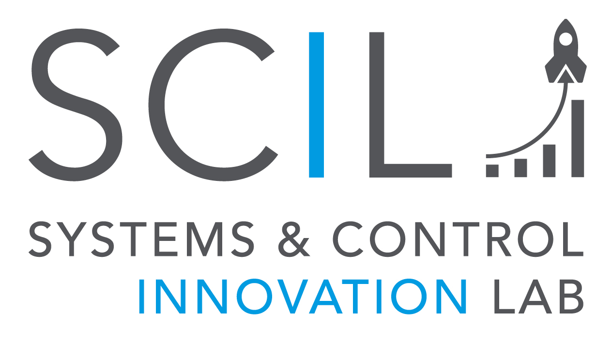

#### Our Goal
The main objective of the Systems and Control Innovation Lab
(SCIL) is to offer Start-up companies and SMEs direct access to
newest design technologies and software tools in the fields of
system simulation, control and optimization. From the early
design phases on, the physical and dynamical properties of
the hardware and software components are considered and
optimized with a multi-domain, integrated approach.

By utilizing newest, not yet commercially available, non-linear
and robust control concepts, systems can be operated at
higher performance, safer and more efficient. The improved
design results can be directly visualized and validated utilizing
modern methods for real-time visualizations. Future SCIL
partners do not only benefit from the available method
knowledge but also from the institute wide application
experience in the different research fields (aerospace,
transportation, energy, security) and from previous technology
transfer projects.

#### 
