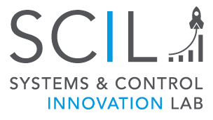
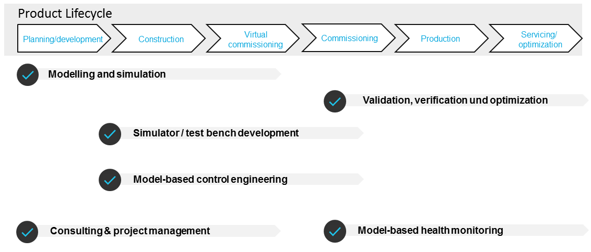

#### Our Goal
The main objective of the Systems and Control Innovation Lab
(SCIL) is to offer Start-up companies and SMEs direct access to
newest design technologies and software tools in the fields of
system simulation, control and optimization. From the early
design phases on, the physical and dynamical properties of
the hardware and software components are considered and
optimized with a multi-domain, integrated approach.

By utilizing newest, not yet commercially available, non-linear
and robust control concepts, systems can be operated at
higher performance, safer and more efficient. The improved
design results can be directly visualized and validated utilizing
modern methods for real-time visualizations. Future SCIL
partners do not only benefit from the available method
knowledge but also from the institute wide application
experience in the different research fields (aerospace,
transportation, energy, security) and from previous technology
transfer projects.

#### Using Modelica for modelling and simulation
A multitude of already commercialized Modelica libraries (PowerTrain Library for
vehicle systems, FlexibleBodies Library for modelling of flexible
bodies, FlightDynamics Library for modelling of aircraft
systems, Visualization Library for model-integrated real-time
visualization, etc.) is complemented by a greater number of
internally used libraries covering the whole spectrum of the
areas transportation, aeronautics, terramechanics, energy
systems, robotics, real-time control as well as multi-criteria- and anti-optimization.

#### Range of Services

#### Research Grants
Innovative research is funded by the EU, the German Federal
Government and their Länder with a multitude of funding
programs, in particular if SMEs and Startups are involved. The
SCIL can support with the selection of a suitable program, as
in many cases the involvement of a large-scale research center
as the DLR increases the chances or is prerequisite of
acceptance of a research proposal. By realizing a joint research
grant even high-risk research projects can be carried out
calculable with funding.

